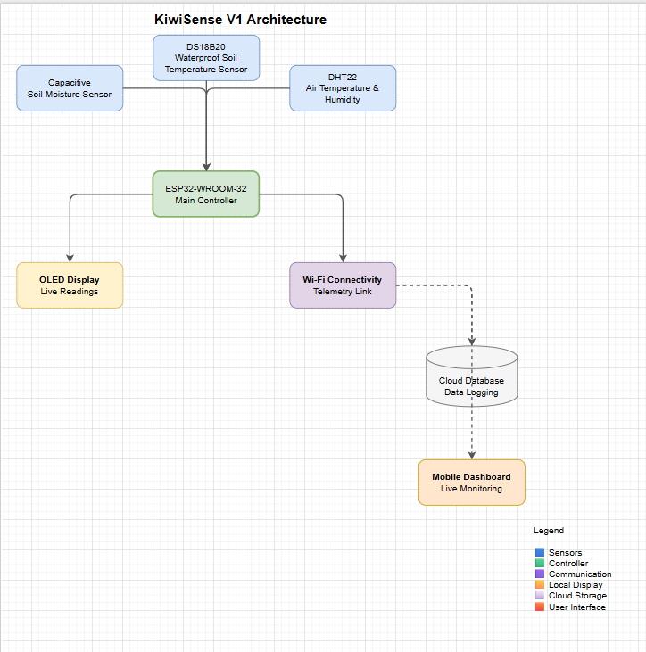
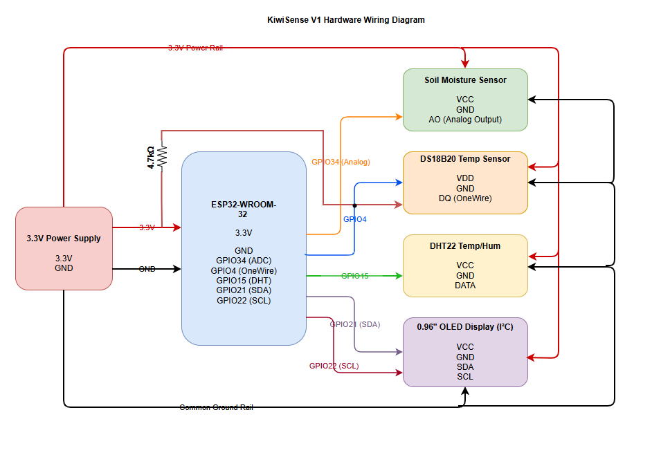

# Hardware

This directory contains the hardware documentation for KiwiSense V1.

## Contents

- GPIO Mapping
- Wiring Diagram
- System Architecture
- Sensor Connections

---

## System Architecture

---

## Wiring Diagram

---

## GPIO Mapping

See [gpio_mapping.md](gpio_mapping.md) for complete GPIO assignments.
